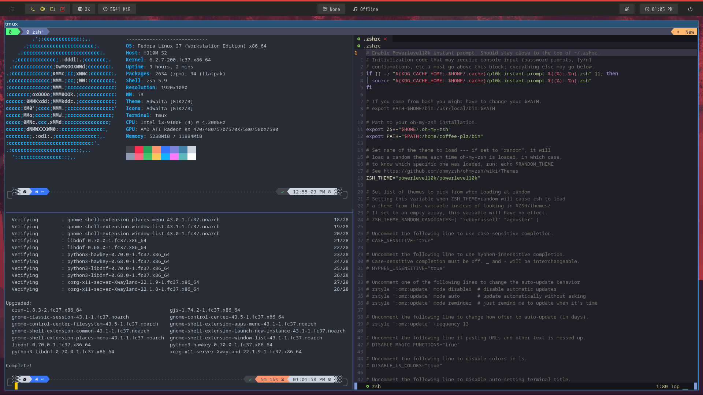

  

    

    

      

        

          

            <h1>Setup Guide for making your boring Terminal Interesting!</h1>
                       
            

Ah, so you want to add some magic to your command line? Well, you've come to the right place my friend!
            

            <h2>Prerequisites</h2>
            

              Before getting started, make sure you have the following tools
              installed:
            

            <ul>
              <li>Kitty terminal emulator</li>
              <li>Tmux terminal multiplexer</li>
            </ul>
            

              Use the following commands to install the prerequisites based on
              your Linux distribution:
            

            <ul>
              <li>Fedora: <code>sudo dnf install kitty tmux i3</code></li>
              <li>
                Debian/Ubuntu: <code>sudo apt-get install kitty tmux i3</code>
              </li>
            </ul>
            <h2>Kitty Setup</h2>
            

              Once you have Kitty installed, open it and use the following
              command to install the <code>kitten themes</code> plugin:
            

            <pre>

<code >kitty +kitten themes
</code>

</pre>
             

              Now let's make kitty transparent:
            

            <pre>

<code>gedit ~/.config/kitty/current-theme.conf
</code>

</pre>
            
add <code>background_opacity 0.8</code>

            

              Now, let's change the default font to a more visually appealing
              font. Install the * Hack Nerd * Font by following the instructions on
              their website:
              <a href="https://www.nerdfonts.com/font-downloads" target="_new"
                >https://www.nerdfonts.com/font-downloads</a
              >
            

            

              Press <code>ctrl+shift+f2</code> inside Kitty and paste the
              following configuration:
            

            <pre>

# font_family      Input Mono 

<code >font_family     Hack Nerd Font Regular
italic_font     Hack Nerd Font Italic
bold_font       Hack Nerd Font Bold
bold_italic_font Hack Nerd Font Bold Italic
</code>

</pre>
            <h2>OhMyZsh Setup</h2>
            

              Zsh is a popular shell that offers more features and customization
              than the default Bash shell. Install OhMyZsh ~a plugin manager for zsh shell by using the following
              command:
            

            <pre>

<code >sh -c "$(curl -fsSL https://raw.githubusercontent.com/ohmyzsh/ohmyzsh/master/tools/install.sh)"
</code>

</pre>
            

            But first make sure zsh & fzf is installed <code>sudo dnf install zsh</code> then after the first configuration --> <code>git clone --depth 1 https://github.com/junegunn/fzf.git ~/.fzf ~/.fzf/install</code>
            

            
Now make zsh your primary shell:

<pre>

<code >chsh -s $(which zsh)
</code>

</pre>

if chsh not installed it will prompt you to install it! press y

            

              Next, install the <code>colorls</code> gem, which adds color and
              icons to the <code>ls</code> command:
            

            
For debian:

                        <pre>

<code >sudo apt-get install ruby ruby-dev
</code>

</pre>

For fedora:

<pre>

<code >sudo dnf install ruby
</code>

</pre>
<pre>

<code >sudo dnf install ruby-devel
</code>

</pre>
<pre>

<code >sudo dnf install gem
</code>

</pre>

Now make sure gcc and g++ is installed then install the gem

            <pre>

<code >gem install colorls
</code>

</pre>
            

              Now, let's add some magic to your shell by installing the popular
              <code>powerlevel10k</code> theme,
              <code>zsh-syntax-highlighting</code> plugin, and
              <code>zsh-autosuggestions</code> plugin:
            

            <pre>

<code >git clone --depth=1 https://github.com/romkatv/powerlevel10k.git ${ZSH_CUSTOM:-$HOME/.oh-my-zsh/custom}/themes/powerlevel10k
git clone https://github.com/zsh-users/zsh-syntax-highlighting.git ${ZSH_CUSTOM:-~/.oh-my-zsh/custom}/plugins/zsh-syntax-highlighting
git clone https://github.com/zsh-users/zsh-autosuggestions ${ZSH_CUSTOM:-~/.oh-my-zsh/custom}/plugins/zsh-autosuggestions
</code>

</pre>
            

              Next, copy the <code>.zshrc</code> file from this repository
              to your home directory:
            

            <pre>

<code >cp .zshrc ~/.zshrc
</code>

</pre>
            

              Now edit the .zshrc and replace all occurances of `coffee-plz` in the file with your unix username (the one that shows up in your terminal)
            

Now source it and follow the power10k's prompted steps accordingly

<pre>

<code >source .zshrc 
</code>

</pre>
            <h2>TPM Setup</h2>
            

              Tmux is a terminal multiplexer that allows you to split your
              terminal into multiple panes and windows. Install the tpm ~tmux plugin manager by using
              the following command:
            

            <pre>

<code >git clone https://github.com/tmux-plugins/tpm ~/.tmux/plugins/tpm
</code>

</pre>
            

              Next, copy the <code>.tmux.conf</code> file from this repository
              to your home directory:
            

            <pre>

<code >cp .tmux.conf ~/.tmux.conf
</code>

</pre>
            

             Finally, start Tmux by entering the <code>tmux</code> command, and source your config file
            

            <pre>

<code > tmux source-file ~/.tmux.conf
</code>

</pre>
            

              then press <code>ctrl-f I</code> to install the plugins using the
              Tmux Plugin Manager, and press <code>ctrl-f r</code> to reload the
              Tmux configuration.
            

            <h2>🫰</h2>
            

And voila! Your command line is now looking stylish, colorful, and powerful. You're now ready to take on the world, one command at a time!
            

          

        

      

  

`go through the tmux config file and .zshrc file in this repo for all the keybinding and shortcuts`
